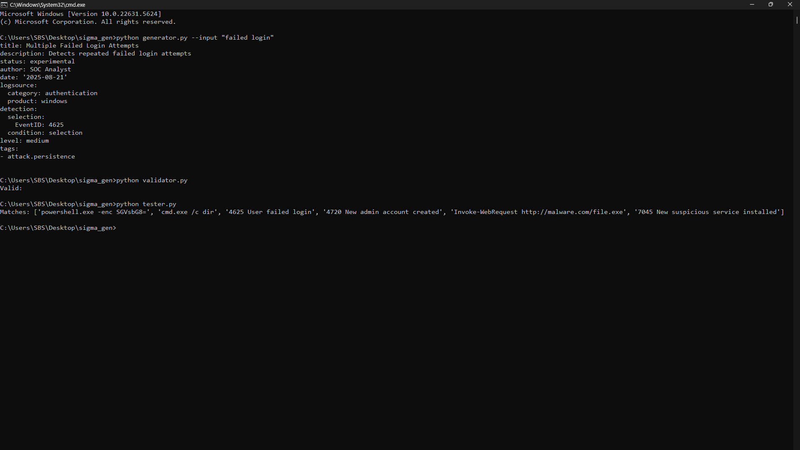

# 🔐 Sigma Rule Generator & Tester


---

## 📖 About
This project provides a simple **Sigma rule generator, validator, and tester** written in Python.  

With this tool you can:
- 🛠️ Generate new Sigma rules automatically  
- ✅ Validate rules for correctness  
- 🔍 Test rules against real logs  

---

## 📸 Demo
Here’s an example of the project in action:



---

## ⚡ Quick Start

Clone the repo:
```bash
git clone https://github.com/melekelkateb/sigma_gen.git
cd sigma_gen
```

### 1️⃣ Generate a Rule
```bash
python generator.py --input "failed login"
```

### 2️⃣ Validate a Rule
```bash
python validator.py
```

### 3️⃣ Test Against Logs
```bash
python tester.py
```

---

## 📝 Example Output

Input:  
```bash
python generator.py --input "failed login"
```

Output:  
```yaml
title: Failed Login Detection
id: auto-generated
status: experimental
logsource:
  product: windows
detection:
  selection:
    EventID: 4625
    Message|contains: ["failed", "login"]
condition: selection
level: medium
date: 2025-08-21
```

---

## 🤝 Contributing
Contributions are welcome!  
- Fork the repo  
- Create a feature branch  
- Submit a pull request  

If you find this project useful, ⭐ **please give it a star** to support development!

---

## 📜 License
This project is licensed under the MIT License.
